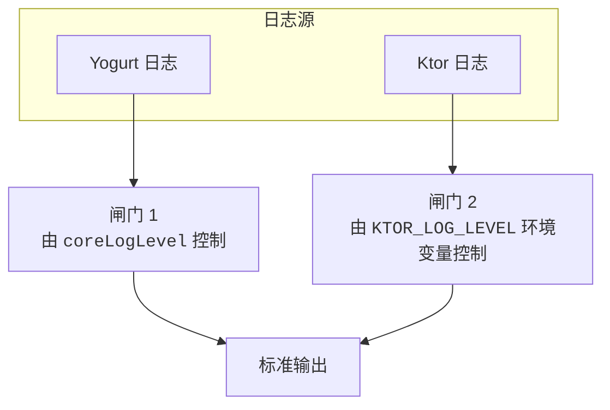
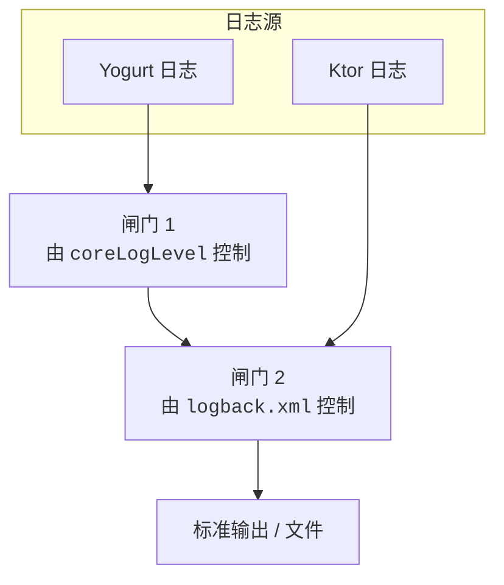

# 配置

Yogurt 在启动后，会在当前工作目录下生成 `config.json` 文件，用户可以编辑该文件来配置 Yogurt。

```json
{
  "signApiUrl": "...",
  "reportSelfMessage": true,
  "preloadContacts": false,
  "transformIncomingMFaceToImage": false,
  "httpConfig": {
    "host": "127.0.0.1",
    "port": 3000,
    "accessToken": "",
    "corsOrigins": []
  },
  "webhookConfig": {
    "url": [],
    "accessToken": ""
  },
  "logging": {
    "coreLogLevel": "DEBUG"
  },
  "skipSecurityCheck": false
}
```

## 配置项说明

### `signApiUrl`

签名服务地址。这是 Yogurt 赖以运行的关键配置项。Yogurt 本身并不处理数据包的签名，而是将这些工作交给一个单独的签名服务来完成。

### `reportSelfMessage`

是否上报自己发送的消息。

### `preloadContacts`

是否在启动时预加载联系人列表。预加载联系人列表可以提升部分操作的响应速度，同时修复部分情况下无法解析 uid 的问题，但会显著增加启动时间和内存占用。

### `transformIncomingMFaceToImage`

> [!note]
>
> 这一配置项为兼容 Milky 1.0 而保留。在 Milky 1.1+ 版本中，市场表情（`market_face`）消息段已包含完整的元信息。

是否将接收的市场表情消息段转换成普通的图片消息段。如果为 `true`，则转换的具体格式如下：

```json
{
  "type": "image",
  "data": {
    "resource_id": "市场表情的 URL",
    "temp_url": "市场表情的 URL",
    "width": 300,
    "height": 300,
    "summary": "市场表情的描述文本",
    "sub_type": "sticker"
  }
}
```

### `httpConfig` 和 `webhookConfig`

Milky 协议服务的有关配置，参考 [Milky 文档的“通信”部分](https://milky.ntqqrev.org/guide/communication)。

### `httpConfig.corsOrigins`

允许跨域请求的来源列表。若为空数组，则允许所有来源。

在允许所有来源时，依然可以通过 Authorization 头携带访问令牌，因为 `Access-Control-Allow-Headers` 头会包含 `Authorization`。

### `logging.ansiLevel`

Yogurt 日志中 ANSI 颜色的输出级别。可选值有 `NONE`, `ANSI16`, `ANSI256` 和 `TRUECOLOR`。如果不设置该配置项，则默认使用 `ANSI256`。如果你的终端不支持 ANSI 颜色，可以将该配置项设置为 `NONE` 来禁用颜色输出，或降级到 `ANSI16`。更详细的说明请参考 [Mordant 文档中的 AnsiLevel](https://ajalt.github.io/mordant/api/mordant/com.github.ajalt.mordant.rendering/-ansi-level/index.html)。

### `skipSecurityCheck`

是否跳过安全检查。安全检查的内容目前有：
- 检测是否在非 Docker 环境下将 HTTP 服务绑定到 `0.0.0.0` 并且未设置访问令牌。

## 日志配置

Yogurt 的日志分为两类：由 Yogurt 自身产生的日志和 Ktor 产生的日志。在不同平台下，日志的配置方式有很大不同。

### Kotlin/Native 平台

Kotlin/Native 平台的 Yogurt 使用 `println` 输出日志。可以想象有以下的闸门：



要控制 Yogurt 日志的输出级别，可以在 `config.json` 中配置 `logging.coreLogLevel`，可选值有 `VERBOSE`, `DEBUG`, `INFO`, `WARN`, `ERROR`。如果不设置该配置项，则默认输出 `DEBUG` 以上级别的日志。

要控制 Ktor 日志的输出级别，可以设置环境变量 `KTOR_LOG_LEVEL`，可选值有 `DEBUG`, `INFO`, `WARN`, `ERROR`。如果不设置该环境变量，则 Ktor 默认输出 `INFO` 级别及以上的日志。

### Kotlin/JVM 平台

Kotlin/JVM 平台的 Yogurt 使用 [Logback](https://logback.qos.ch/) 进行日志管理。可以想象有以下的闸门：



要控制 Yogurt 日志的输出级别，可以在 `config.json` 中配置 `logging.coreLogLevel`，设置方式和 Kotlin/Native 平台相同。

Yogurt/JVM 的日志最终由 Logback 处理，因此可以通过配置 Logback 来控制日志的输出方式和格式。JAR 文件中已经包含了一个默认的 `logback.xml`，默认向控制台输出带有颜色的、最低等级为 `DEBUG` 的日志，内容如下：

```xml
<configuration>
    <statusListener class="ch.qos.logback.core.status.NopStatusListener"/>
    <appender name="CONSOLE" class="org.ntqqrev.yogurt.util.YogurtConsoleAppender"/>
    <root level="DEBUG">
        <appender-ref ref="CONSOLE"/>
    </root>
</configuration>
```

如果需要自定义日志配置，可以在运行时通过 `-Dlogback.configurationFile=path/to/logback.xml` 指定自定义的配置文件。你可以基于上述配置进行自定义。
